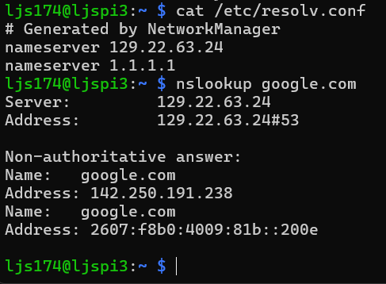
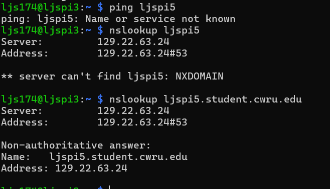
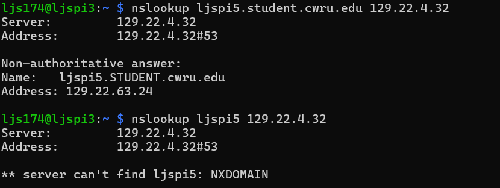

# Pihole Configuration

Since this is a Pi based homelab, we of course have to setup Pihole for DNS filtering and some DHCP as well. 

## DNS

I'm going to run the containerized pihole with docker. I am going to run this with docker compose both for learning purposes and because it will be easier to add onto it later. Looking through the github and documentation I decided to start with a fairly standard [compose file](./compose.yaml). However, I did want to try to use Docker secrets to manage the password to the pi along the lines of the documentations' [suggested setup](./secret_setup.yaml). However, every time I tried the password on the web service, it denied me. I triple checked the file was exactly the password, without any newline or carriage return characters, with hexdump. I copied and pasted the password from the file into the web service, and still no dice. Maybe I'll return to this in the future, but I want to move forward.

Now, we just have to connect the other pi to use the DNS of the pihole. I used nmcli with the commands:
```
sudo nmcli con mod "Wired connection 1" ipv4.dns "129.22.63.24 1.1.1.1"
sudo nmcli con mod "Wired connection 1" ipv4.ignore-auto-dns yes
sudo nmcli con up "Wired connection 1"
```
and let it run. We add 1.1.1.1 as failover to Cloudflare DNS.
Now, our /etc/resolv.conf looks like below, and we can run nslookup on google.com to ensure that our pi is working.



We have liftoff! Unfortunately, we lose access to CWRU DNS aliases which tells us where our ljspi5 is (where pihole is running). However, we can still access ljspi5.case.edu or ljspi5.student.cwru.edu. 



I tried adding the CWRU DNS server that my pi was originally configured to. However, it still couldn't resolve ljspi5, but it could resolve the full one:



This is probably something on case's end. Looking up ljspi3 from the pi5 works fine I have no idea why this is happening :D

## DHCP

To be continued when I have the time