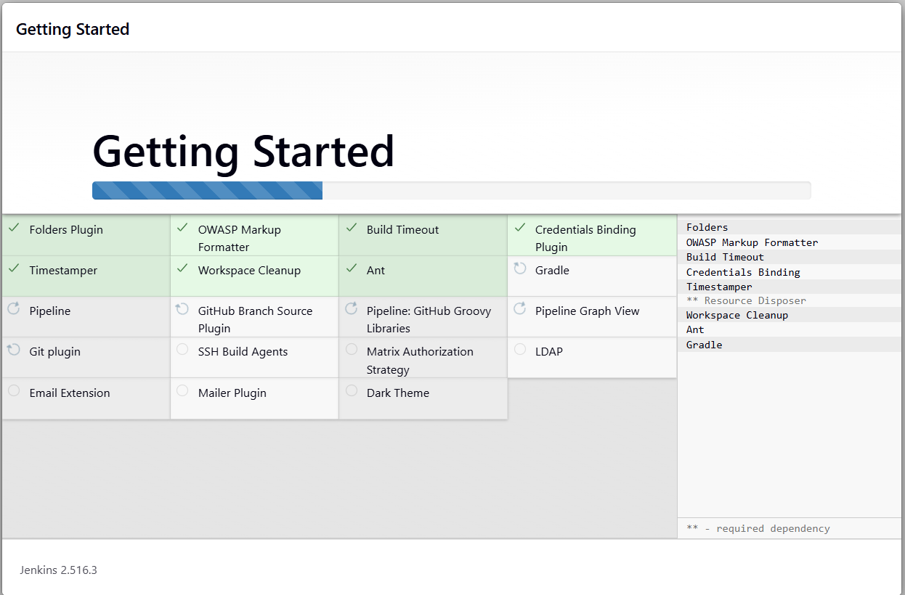
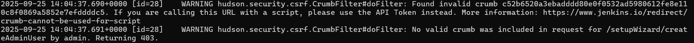
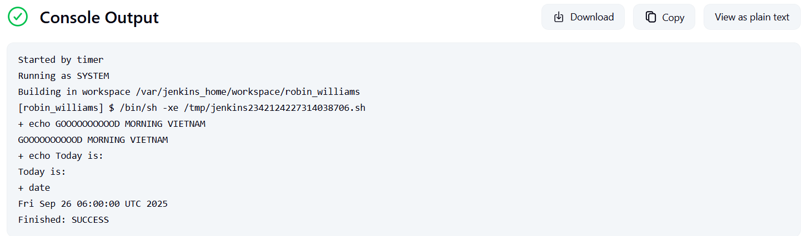

# Jenkins

I wanted to learn how to use Jenkins, since it's a highly used tool in the DevOps world. A lot of the code I'll be running is very simplistic, the point is not to ship an app but to learn how to use the tool. Big thanks to [DevOps Journey](https://github.com/devopsjourney1/) for the great tutorial on youtube! I ultimately couldn't use his repo due to outdated dependencies throwing some errors, but he has a great youtube video on the subject which helped me understand what I was doing in much more depth.

I just built the docker container on my pi5. The walkthrough in the documentation had me set it up in the docker:dind containerized environment, but I decided I wanted to run it natively on my pi, so I modified the setup a little. In a production environment I would never do this (security obviously), I just wanted the setup to be simple so I could get right to working in Jenkins. The /[Dockerfile](./Dockerfile) was unmodified from the documentation. 

```
docker run \
  --name jenkins-blueocean \
  --restart=on-failure \
  --detach \
  --network jenkins \
  --publish 8080:8080 \
  --publish 50000:50000 \
  --volume jenkins-data:/var/jenkins_home \
  --volume jenkins-docker-certs:/certs/client:ro \
  myjenkins-blueocean:2.516.3-1
docker build -t myjenkins-blueocean:2.516.3-1 .
```



And we're in! Now to set up with creds and we should be good to go.

I hit a little snafu because of TLS certificates (I think) causing Jenkins to not trust my browser session on my laptop. 


Fixed this by ssh -L 8080:localhost:8080 ljs174@ljspi5 into the pi to forward my local 8080 into the pi's 8080. This worked just fine. Now we have to set up a build. I decided to start small with a hello world type of build executed with shell scripts inside the Jenkins container. The configuration was set to execute the build on a cron job: `0 6 * * *`. In reality you should use H to split up the load but since this is the only job (and extremely time sensitive as we will see) I am going to use it as such. 



And voila.